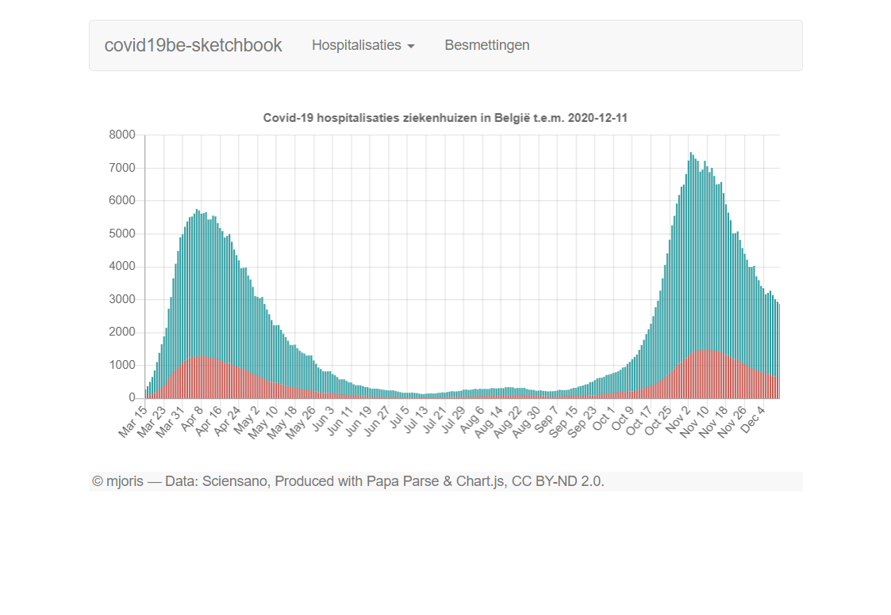
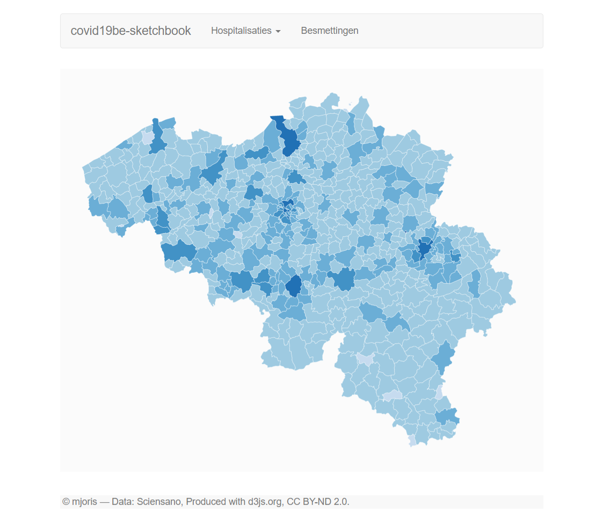

# COVID-19 Sketchbook

2 *quick-and-dirty* proof-of-concept (web) applications for the direct visualization of COVID-19 datasets provided by Sciensano (Belgium)
 * **poc1-jupyternotebook** contains a *Jupyter* notebook which downloads the "Hospitalisations by date and provinces" data set by Sciensano (throuhh *pandas*) and generates a set of interactive *plotly* bar charts, which are shown in a webpage. The charts involve hospitalisation stats for several regions and provinces.
 * **poc2-js** involves a 100% client-side approach. It is *JavaScript* web application consisting of two proof-of-concept pages:
   * **index.html** uses *Papa Parse* to load the above mentioned data set, and *Chart.js* in order to visualise the very same type of interactive bar charts (dynamic load)
   * **contam.html** uses *d3js.org* to load the "Cumulative number of confirmed cases by municipality" data set by Sciensano and to show these numbers on a choropleth map of Belgium

<table>
  <tr>
    <td></td>
    <td></td>
  </tr>
</table>

